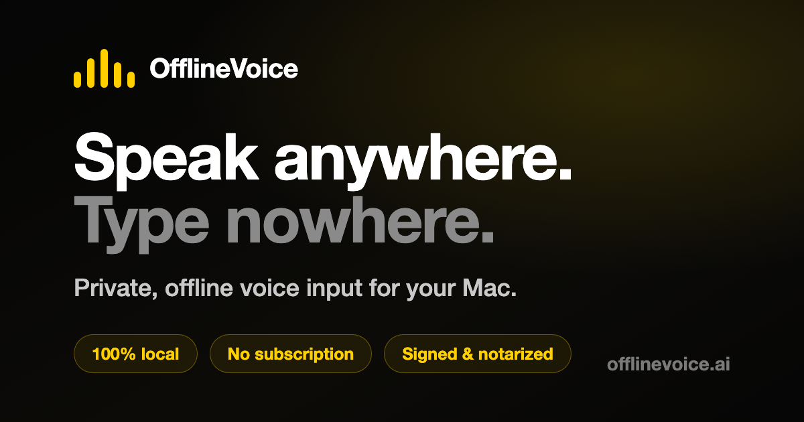
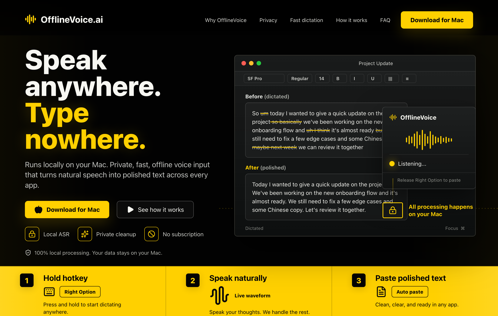
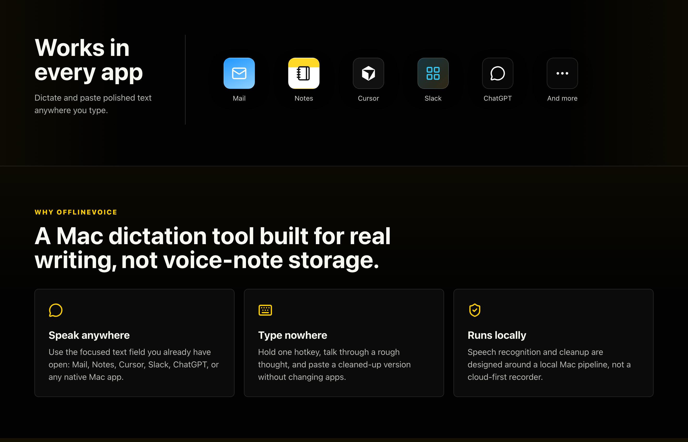
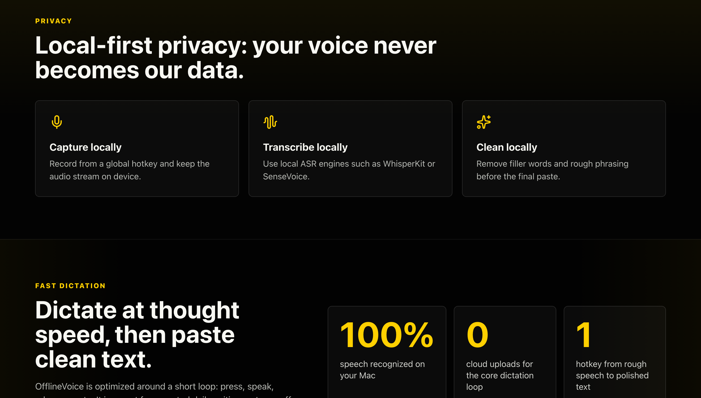

# OfflineVoice

**Speak anywhere. Type nowhere.**
Private, offline voice input for your Mac.

[**↓ Download for Mac**](https://www.offlinevoice.ai/downloads/OfflineVoice-mac.dmg) · [offlinevoice.ai](https://www.offlinevoice.ai) · [Latest release](../../releases/latest)

---

Hold one key, talk, release — your speech becomes polished text in any app.
Transcription and cleanup run **entirely on your Mac**. No account, no
subscription, no cloud upload.

## Download

OfflineVoice is **signed with an Apple Developer ID and notarized by Apple**, so
it opens normally with no Gatekeeper warning.

- 🌐 **Official site:** https://www.offlinevoice.ai
- ⬇️ **Direct download (macOS):** [OfflineVoice-mac.dmg](https://www.offlinevoice.ai/downloads/OfflineVoice-mac.dmg)
- 📦 **GitHub release:** [Releases](../../releases/latest)

> Only download from these official channels.

## Screenshots

## Why OfflineVoice

- **100% local** — speech recognition (WhisperKit) and optional cleanup run on
  your Mac. Audio and text never leave the device.
- **Works in every app** — pastes into the focused field across native Mac apps.
- **Hold‑to‑talk** — hold **Right Option** (configurable), speak, release to paste.
- **Chinese + English** — built for Chinese, English, and mixed‑language dictation.
- **Per‑app tone & hotwords** — a writing tone per app, plus a local dictionary
  to fix recurring mis‑hears.
- **No account, no subscription.**

## Requirements

- macOS 14 (Sonoma) or later, Apple Silicon
- ~1.5 GB disk for the local model (downloaded once on first use)
- *(Optional)* [Ollama](https://ollama.com) for filler‑word/punctuation cleanup

## Install

1. Open the DMG and drag **OfflineVoice** to Applications, then launch it.
2. Grant **Microphone** and **Accessibility** when prompted (Accessibility is what
   lets OfflineVoice paste into other apps).
3. Hold **Right Option**, speak, release.

## Privacy

OfflineVoice does not upload your audio, does not sync transcripts, and does not
train on your data. Model files are cached locally after first download.
Full [privacy policy](https://www.offlinevoice.ai/#privacy-policy).

---

Official channels only — **[offlinevoice.ai](https://www.offlinevoice.ai)** · GitHub Releases

