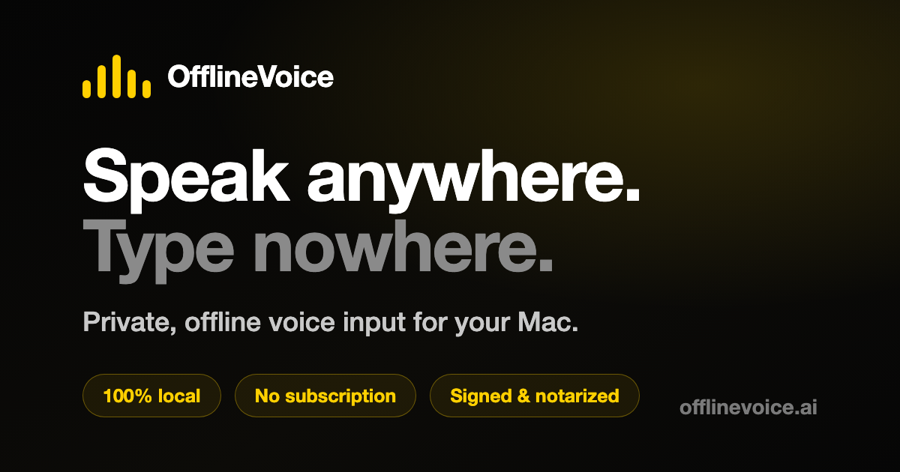

# OfflineVoice

<p align="center">
  
</p>

OfflineVoice is the fastest local voice dictation for Mac. Hold one hotkey and speak, transcription runs entirely on your machine, and the text is pasted straight into the focused input field. Because nothing leaves your Mac, it is both faster and more private than tools that depend on the cloud.

No cloud. No account. No subscription. Your audio and text never leave the device. **Free and open source (GPL-3.0).**

<p align="center">
  <a href="https://www.offlinevoice.ai/api/download">
    
  </a>
  &nbsp;
  <a href="https://www.offlinevoice.ai">
    
  </a>
</p>

<p align="center">
  <sub>macOS 13+ · Apple Silicon · signed &amp; notarized — just double-click to open.</sub>
</p>

```text
Hold key → on-device ASR → paste
```

> One click: **[⬇ Download OfflineVoice for Mac (.dmg)](https://www.offlinevoice.ai/api/download)** — or build from source below.

The current repo contains two deliverables:

- `OfflineVoice.app`: the macOS Dock app with a menu-bar status icon.
- `website/`: the public landing page with a real Download for Mac button.

## What Works Today

- Local macOS app build through Xcode.
- Branded App icon, Dock-visible app shell, and menu-bar status icon.
- First-run onboarding for positioning, permissions, and the hotkey.
- Main window with Home, Settings, Shortcuts, Privacy & Local AI, and About pages.
- Global push-to-talk with default `Right Option`, editable from the app UI.
- Microphone, Speech Recognition, and Accessibility permission status with settings shortcuts.
- Two on-device recognition modes you choose from the Privacy & Local AI page:
  - **Speed** (default): Apple's native on-device speech recognition. Near-instant — text appears almost as soon as you stop talking — and the most lightweight option, with zero extra downloads.
  - **Accuracy**: Whisper (large-v3 turbo) for more accurate English and technical or specialized content. The model downloads once to your machine on first use, then works offline.
- Works in any app: the recognized text is pasted into the focused input field.
- Website landing page for the "fastest local voice dictation for Mac" positioning.
- Real website download path at `/downloads/OfflineVoice-mac.dmg`.
- DMG packaging script: a Developer ID build is written to `website/public/downloads/`, while an unsigned local build goes to `dist/local-preview/`.

## Requirements

- macOS 13+
- Xcode
- Node.js 20+ for the website
- Optional: [XcodeGen](https://github.com/yonaskolb/XcodeGen) if regenerating `OfflineVoice.xcodeproj` from `project.yml`

Speed mode uses Apple's built-in on-device speech recognition and needs no downloads. Accuracy mode downloads the Whisper model on first use and caches it locally for offline use afterwards.

## Local Website Development

```bash
cd website
npm install
npm run dev
```

Open the printed local URL. The Download for Mac button points to:

```text
/downloads/OfflineVoice-mac.dmg
```

In development this resolves to:

```text
website/public/downloads/OfflineVoice-mac.dmg
```

## Build the Website

```bash
cd website
npm run build
```

The static site is emitted to `website/dist/`.

## Deploy the Website

The current Vercel project is `owens-projects-ba5444b1/website`.

```bash
npx vercel deploy --prod --cwd website --scope owens-projects-ba5444b1 --yes
```

Public preview:

```text
https://website-owens-projects-ba5444b1.vercel.app
```

## Build the Mac App

```bash
xcodegen generate
xcodebuild \
  -project OfflineVoice.xcodeproj \
  -scheme OfflineVoice \
  -configuration Release \
  -destination 'platform=macOS' \
  -derivedDataPath build \
  build
```

The app is created at:

```text
build/Build/Products/Release/OfflineVoice.app
```

If you only changed Swift files, `xcodegen generate` is usually not required. Run it after changing `project.yml`, assets, bundle settings, package dependencies, or Info.plist generation settings.

## Generate the Installer DMG

Run the packaging script from the repo root:

```bash
./scripts/package-mac.sh
```

The script:

1. Builds the Release app.
2. Copies `OfflineVoice.app` into a DMG staging folder.
3. Adds the OfflineVoice DMG volume icon when available.
4. Ad-hoc signs the staged app for local testing.
5. Creates the downloadable DMG.
6. Writes a SHA-256 checksum next to it.

Generated files:

```text
website/public/downloads/OfflineVoice-mac.dmg
website/public/downloads/OfflineVoice-mac.dmg.sha256
```

## Update the Website Download

To publish a new local website download:

```bash
./scripts/package-mac.sh
cd website
npm run build
```

Deploy or serve `website/dist/`. Vite copies `website/public/downloads/OfflineVoice-mac.dmg` into the built site automatically.

## Public Trial Checklist

Before sending a link to another Mac user:

```bash
./scripts/package-mac.sh
cd website
npm run build
npm run dev
```

Then verify:

1. Open the local website.
2. Click **Download for Mac** and confirm `/downloads/OfflineVoice-mac.dmg` downloads.
3. Open the DMG and drag `OfflineVoice.app` to Applications, or open it from the mounted image for a quick smoke test.
4. Approve any macOS security prompts on first launch.
5. Approve Microphone access.
6. Approve Speech Recognition access for Speed mode.
7. Use the menu-bar icon to open Accessibility settings if needed, then enable OfflineVoice.
8. Put the cursor in any input field, hold `Right Option`, speak, and release.

## First-Run Permissions

OfflineVoice is a Dock-visible Mac app with an optional menu-bar status icon.

Users should:

1. Open `OfflineVoice.app`.
2. Complete the onboarding window.
3. Approve Microphone access when macOS asks.
4. Approve Speech Recognition access for Speed mode (Apple's on-device recognizer).
5. Open Accessibility settings from onboarding or Home if shown, then enable OfflineVoice.
6. Confirm the default shortcut or record a new shortcut in Settings.
7. Put the cursor in any text field, hold the shortcut, speak, and release.

Microphone and Speech Recognition are required for on-device transcription. Accessibility is required for the global push-to-talk key and automatic paste.

## App Settings

OfflineVoice v0.4.0 stores user settings at:

```text
~/.config/offlinevoice/config.json
```

The app UI manages:

- First-run onboarding completion.
- Launch at login.
- Menu-bar icon visibility.
- Auto paste and clipboard restore behavior.
- Primary dictation shortcut.
- Recognition mode (Speed or Accuracy) and the Whisper model used in Accuracy mode.

Switching recognition mode reloads the transcription engine in place — no restart needed. The next dictation simply waits for the new engine to finish loading.

## Signed & Notarized Distribution

Public OfflineVoice builds are signed with a Developer ID certificate and notarized by Apple, so the DMG opens with a simple double-click and no Gatekeeper warning.

Local builds you produce yourself without signing credentials are ad-hoc signed for testing only. If macOS blocks an unsigned local build:

1. Right-click `OfflineVoice.app` and choose **Open**, then confirm **Open** in the dialog.
2. Or open **System Settings ▸ Privacy & Security** and click **Open Anyway**.
3. You only need to do this once.

### Signing & notarizing for public distribution

`scripts/package-mac.sh` produces an ad-hoc DMG by default. To ship a signed,
notarized DMG that opens without any Gatekeeper prompt, you need an Apple
Developer Program membership and a **Developer ID Application** certificate in
your keychain, then store notary credentials once:

```bash
xcrun notarytool store-credentials "OfflineVoice-Notary" \
  --apple-id <apple-id> --team-id <TEAMID> --password <app-specific-password>
```

Then run the packager with both env vars set — it signs with the Hardened
Runtime + entitlements, notarizes, and staples the ticket:

```bash
DEVELOPER_ID_IDENTITY="Developer ID Application: Your Name (TEAMID)" \
NOTARY_PROFILE="OfflineVoice-Notary" \
  ./scripts/package-mac.sh
```

Setting only `DEVELOPER_ID_IDENTITY` signs + verifies but skips notarization;
setting neither falls back to the ad-hoc build.

## Temporary Choices and Follow-Ups

- The public download is a checked-in/static file under `website/public/downloads/`.
- Translate and Ask Anything are visible as future shortcut modes but disabled in v0.4.0.
- Launch at login uses `SMAppService`.
- Switching recognition mode from the UI is persisted and reloads the engine in place.
- The website product preview is a designed placeholder until real screenshots or a screen recording are captured.
- A proper release flow should produce versioned artifacts, checksums, release notes, and notarized DMGs.
